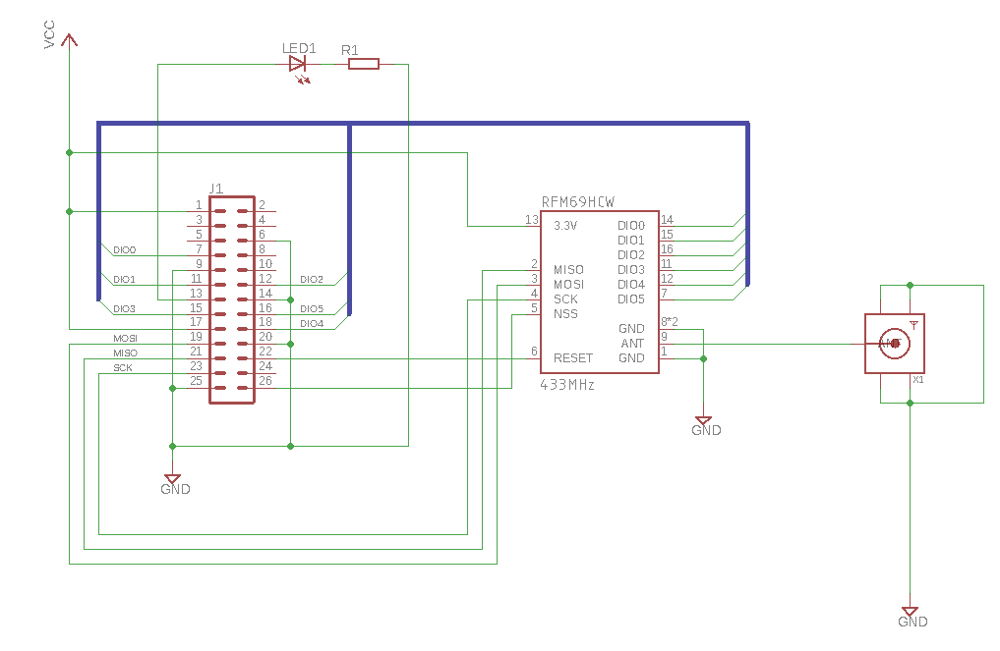

# HopeRF RFM69 Transceiver

The HopeRF RFM69HW module is an radio transceiver capable of receiving and transmitting
signals using FSK and OOK modulation. Ultimately it's a popular general purpose device
for general data transmission and integration with many cheap electronics which use
either the 433MHz or 900MHz bands.

  * The RFM69HW datasheet [link](RFM69HW-V1.3.pdf)
  * List of HopeRF transceiver modules [link](https://www.hoperf.com/modules/rf_transceiver/index.html)

## Printed Circuit Board 

The module is mounted on a custom-made PCB which you'll have to construct. You can
manufacture a PCB from Aisler [here](https://aisler.net/p/MINCPAPN). Total cost
including components would cost about £12 / €14 / $14 per unit. This is the
bill of materials:

| Name  | Part               | Description |
| ----- | ------------------ | ---- |
| X1    |  SMA Connector     | Straight 50Ω PCB Mount Bulkhead Fitting SMA Connector, Solder Termination |
| U1    |  Hope RFM69HCW     | HopeRF RF Transceiver RFM69W-433-S2 433 MHz, 1.8 → 3.6V |
| R1    |  330Ω ±5% 0.25W    | Carbon Resistor, 0.25W, 5%, 330R |
| C1,C2 |  0.1uF             | Ceramic Decoupling Capacitors, 0.1uF |
| LED1  |  Generic LED       | LED, 5mm (T-1 3/4) Through Hole package |
| J1    |  26 Way PCB Header | 2.54mm Pitch 13x2 Rows Straight PCB Socket |

Here's the schematic:



In addition you'll want to purchase a 433Mhz antenna with an SMA connector which
will cost an extra couple of Euros, or you can simply solder a 50ohm 173mm wire if you
want to omit the expensive SMA connector. 

The pinouts for the module then correspond to the following physical and GPIO pins:

| RFM69 Pin | Physical | GPIO Pin | Description             |
| --------- | -------- | -------- | ----------------------- |
| MISO      |  21      | SPI_MISO | SPI Master In Slave Out |
| MOSI      |  19      | SPI_MOSI | SPI Master Out Slave In |
| SCK       |  23      | SPI_CLK  | SPI Clock               |
| NSS       |  26      | SPI_CE1  | SPI Chip Select CE1     |
| RESET     |  22      | GPIO25   | Module Reset            |
| DIO0      |   7      | GPIO4    | Data In Out 0           |
| DIO1      |  11      | GPIO17   | Data In Out 1           |
| DIO2      |  12      | GPIO18   | Data In Out 2           |
| DIO3      |  15      | GPIO22   | Data In Out 3           |
| DIO4      |  18      | GPIO24   | Data In Out 4           |
| DIO5      |  16      | GPIO23   | Data In Out 5           |

In addition there's a connection for an LED on physical pin 13,
which can be programmed to be GPIO17 or GPIO27 depending on the model
of Raspberry Pi you have.

## The Command Line Tool 

Once you've constructed the PCB you can plug it in and communicate with
it on the SPI bus. In order to install and/or run the command-line tool, use the
following:

```
bash% cd $GOPATH/src/github.com/djthorpe/sensors
bash% go (run|install) -tags spi ./cmd/rfm69/...
```

The command-line tool has the following flags:

```
bash% rfm69 -help
Usage: rfm69 <flags> (<command>)

Commands:
  TriggerAFC
  ClearFIFO
  ReadFIFO
  ReadPayload
  Status
  ReadTemperature

Flags:
  -aes_key string
    	AES Key (16 bytes) or empty
  -afc_mode string
    	AFC Mode (off, on, autoclear), 
  -afc_routine string
    	AFC Routine (standard, improved)
  -bitrate float
    	Bitrate (kbps)
  -broadcast_addr string
    	Broadcast Address (byte)
  -datamode string
    	Data Mode (packet,nosync,sync)
  -fifo_threshold uint
    	FIFO Threshold (bytes)
  -freq_carrier float
    	Carrier Frequency (kbps)
  -freq_dev float
    	Frequency Deviation (kbps)
  -listen
    	Enable listen mode
  -mode string
    	Device Mode (sleep,standby,fs,tx,rx,listen)
  -modulation string
    	Modulation (fsk,fsk_1.0,fsk_0.5,fsk_0.3,ook,ook_br,ook_2br)
  -node_addr string
    	Node Address (byte)
  -packet_coding string
    	Packet Coding (off, manchester, whitening)
  -packet_crc string
    	Packet CRC (off, autoclear_off, autoclear_on)
  -packet_filter string
    	Packet Filtering (off, node, broadcast)
  -packet_format string
    	Packet Format (fixed, variable)
  -payload_size uint
    	Payload Size (bytes)
  -preamble_size uint
    	Preamble Size (bytes)
  -sequencer
    	Enable sequencer
  -spi.bus uint
    	SPI Bus
  -spi.delay uint
    	SPI Transfer delay in microseconds
  -spi.slave uint
    	SPI Slave
  -sync_tol uint
    	Sync Word Tolerance (0-7 bits)
  -sync_word string
    	Sync Word (1-8 bytes) or empty
  -temp_calibration float
    	Temperature Calibration Offset
  -timeout duration
    	FIFO and Payload read timeout (default 5s)
```

The default command that can be run is `Status` in which case the following
sample output could be provided:

```
bash% rfm69 -spi.slave 1 Status
+----------------+---------------------------------------------------------+
|    REGISTER    |                          VALUE                          |
+----------------+---------------------------------------------------------+
| mode           | rx                                                      |
| listen         | off                                                     |
| sequencer      | enabled                                                 |
| modulation     | fsk                                                     |
| bitrate        | 4.8 kbps                                                |
| freq_carrier   | 434.049831 MHz                                          |
| freq_dev       | 30.012 KHz                                              |
| afc            | 0 Hz                                                    |
| afc_mode       | RFM_AFCMODE_OFF                                         |
| afc_routine    | RFM_AFCROUTINE_STANDARD                                 |
| lna_impedance  | RFM_LNA_IMPEDANCE_50                                    |
| lna_gain       | RFM_LNA_GAIN_AUTO                                       |
|                | (RFM_LNA_GAIN_G1)                                       |
| rxbw_frequency | RFM_RXBW_FREQUENCY_FSK_62P5,RFM_RXBW_FREQUENCY_OOK_31P3 |
| rxbw_cutoff    | RFM_RXBW_CUTOFF_4                                       |
| datamode       | packet                                                  |
| packet_format  | variable                                                |
| packet_coding  | manchester                                              |
| packet_filter  | off                                                     |
| packet_crc     | off                                                     |
| node_addr      | 0x04                                                    |
| broadcast_addr | 0x00                                                    |
| preamble_size  | 3 bytes                                                 |
| payload_size   | 64 bytes                                                |
| sync_word      | 2DD4                                                    |
| sync_tol       | 0 bits                                                  |
| aes_key        | disabled                                                |
| fifo_threshold | 1 bytes                                                 |
+----------------+---------------------------------------------------------+
```

You can set various parameters using flags to the command line tool. Using
the `ReadPayload` command will wait for a payload to be read from RF, or
timeout if the payload could not be read.

## RFM69 Interface

The interface for the RFM69 is as follows:

```

type RFM69 interface {
	gopi.Driver

	// Mode, Data Mode and Modulation
	Mode() RFMMode
	DataMode() RFMDataMode
	SetMode(device_mode RFMMode) error
	SetDataMode(data_mode RFMDataMode) error
	Modulation() RFMModulation
	SetModulation(modulation RFMModulation) error

	// Bitrate & Frequency
	Bitrate() uint
	FreqCarrier() uint
	FreqDeviation() uint
	SetBitrate(bits_per_second uint) error
	SetFreqCarrier(hertz uint) error
	SetFreqDeviation(hertz uint) error

	// Listen Mode and Sequencer
	SetSequencer(enabled bool) error
	SequencerEnabled() bool
	SetListenOn(value bool) error
	ListenOn() bool

	// Packets
	PacketFormat() RFMPacketFormat
	PacketCoding() RFMPacketCoding
	PacketFilter() RFMPacketFilter
	PacketCRC() RFMPacketCRC
	SetPacketFormat(packet_format RFMPacketFormat) error
	SetPacketCoding(packet_coding RFMPacketCoding) error
	SetPacketFilter(packet_filter RFMPacketFilter) error
	SetPacketCRC(packet_crc RFMPacketCRC) error

	// Addresses
	NodeAddress() uint8
	BroadcastAddress() uint8
	SetNodeAddress(value uint8) error
	SetBroadcastAddress(value uint8) error

	// Payload & Preamble
	PreambleSize() uint16
	PayloadSize() uint8
	SetPreambleSize(preamble_size uint16) error
	SetPayloadSize(payload_size uint8) error

	// Encryption Key & Sync Words for Packet mode
	AESKey() []byte
	SetAESKey(key []byte) error
	SyncWord() []byte
	SetSyncWord(word []byte) error
	SyncTolerance() uint8
	SetSyncTolerance(bits uint8) error

	// AFC
	AFC() uint
	AFCMode() RFMAFCMode
	AFCRoutine() RFMAFCRoutine
	SetAFCRoutine(afc_routine RFMAFCRoutine) error
	SetAFCMode(afc_mode RFMAFCMode) error
	TriggerAFC() error

	// Low Noise Amplifier Settings
	LNAImpedance() RFMLNAImpedance
	LNAGain() RFMLNAGain
	LNACurrentGain() (RFMLNAGain, error)
	SetLNA(impedance RFMLNAImpedance, gain RFMLNAGain) error

	// Channel Filter Settings
	RXFilterFrequency() RFMRXBWFrequency
	RXFilterCutoff() RFMRXBWCutoff
	SetRXFilter(RFMRXBWFrequency, RFMRXBWCutoff) error

	// FIFO
	FIFOThreshold() uint8
	SetFIFOThreshold(fifo_threshold uint8) error
	ReadFIFO(ctx context.Context) ([]byte, error)
	WriteFIFO(data []byte) error
	ClearFIFO() error

	// ReadPayload listens for a packet and returns it. If the data is
	// read then it will also return true if the CRC value was
	// correct, or false otherwise
	ReadPayload(ctx context.Context) ([]byte, bool, error)

	// WritePayload writes a packet a number of times, with a delay between each
	// when the repeat is greater than zero
	WritePayload(data []byte, repeat uint, delay time.Duration) error

	// MeasureTemperature and return after calibration
	MeasureTemperature(calibration float32) (float32, error)
}
```

There are some missing methods for setting power levels and measuring signal
noise.

(more information on the module here shortly)

